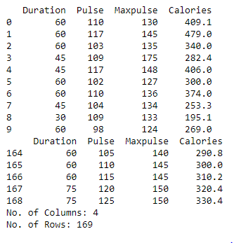

# Read-from-CSV

## ALGORITHM:
### Step 1:
Import pandas as pd.

### Step 2:
Read the CSV file using read_csv method.

### Step 3:
Use head and tail method to get the required contents from the file.

### Step 4:
Use len() method to get the number of rows and columns.

### Step 5:
Print the output.

## PROGRAM:
```
#To write a python program for reading content from a CSV file.
#Developed By:Paul Andrew D
#Register Number:21500230

import pandas as pd
df=pd.read_csv('data.csv')
print(df.head(10))
print(df.tail())
print('No. of Columns:',len(df.axes[1]))
print('No. of Rows:',len(df.axes[0]))
```
## OUTPUT:


## RESULT:
Thus a python program is written to read the contents of a CSV file.